```mermaid
sequenceDiagram
    autonumber

    rect rgb(40, 40, 40)
    Note over Client, Server: Standard TCP Connection (Logged)
    Client->>Server: SYN (Attempt Connection)
    Server-->>Client: SYN-ACK (Port is Open)
    Client->>Server: ACK (Establish Connection)
    Note over Server: Connection established.<br/>Application creates a log entry.
    end

    rect rgb(20, 40, 50)
    Note over Scanner, Target: Stealth SYN Scan (Unlogged)
    Scanner->>Target: SYN (Is Port Open?)
    Target-->>Scanner: SYN-ACK (Yes, Open!)
    Scanner->>Target: RST (Nevermind, RESET!)
    Note over Target: Connection aborted by OS.<br/>NO LOG generated in App Layer.
    end

```

# 🕵️‍♂️ Stealth Port Scanner


A high-performance, fully containerized **TCP SYN Port Scanner** built with Python and Scapy. This tool provides fast network reconnaissance by utilizing multithreading and manipulating packets at a low level to perform Half-Open scans.

<div align="center">
  
  <br/>
  <em>"Reconnaissance without leaving a trace | Reconocimiento sin dejar rastro"</em>
</div>

---
<div align="center">
  <strong>Read in / Leer en:</strong>
  <br/>
  <a href="#-en">🇺🇸 EN</a> &nbsp;|&nbsp; <a href="#-es">🇪🇸 ES</a>
</div>

---

## 🇺🇸 EN

### 💡 The Architecture (TCP vs. Stealth)

To understand how this scanner achieves stealth, we must analyze how standard TCP communication differs from a modified, malicious one.

* **Standard Connection (Logged):** Connecting to a server requires a 3-way handshake. Once completed, the OS passes the connection to the application (e.g., Apache), which creates a log entry.
* **Stealth SYN Scan (Unlogged):** We manipulate the raw packet headers. We send the initial request (`SYN`), receive confirmation from the target (`SYN-ACK`), and **immediately** drop the connection by sending a Reset (`RST`) packet before the target logs the interaction.

---



---

### 🛠️ Core Features

| Feature | Description |
| --- | --- |
| **Speed** | Utilizes `concurrent.futures` to map and execute multithreaded requests, launching 100 simultaneous workers to scan hundreds of ports in seconds. |
| **Stealth** | Implements a true Half-open scan, abusing low-level TCP flag manipulation to receive responses without establishing a full, loggable connection. |
| **Evasion** | Helps bypass basic firewall tracking and Intrusion Detection Systems (IDS) by generating randomized source ports for every individual packet. |
| **Clean** | Fully containerized via Docker. It requires zero host-level dependencies (like `libpcap` or `tcpdump`), keeping your main operating system pristine. |

---

### 🚀 Installation & Usage

1. **Clone the repository:**

```bash
git clone [https://github.com/franlrs/stealth-scanner.git](https://github.com/franlrs/stealth-scanner.git)
cd stealth-scanner

```

2. **Configure the Target IP:**
Open the `docker-compose.yaml` file and modify the `TARGET_IP` environment variable to match your target.

```yaml
    environment:
      - TARGET_IP=10.9.128.1

```

3. **Execute the Scanner:**
Run the following command. The `--rm` flag ensures the container is completely destroyed after the scan finishes.

```bash
docker compose run --rm stealth-scanner

```

---

## 🇪🇸 ES

### 💡 La Arquitectura (TCP vs. Sigiloso)

Para entender cómo este escáner logra el sigilo, debemos analizar cómo difiere una comunicación TCP estándar de una modificada.

* **Conexión Estándar (Registrada):** Conectarse a un servidor requiere un protocolo de enlace de 3 vías. Una vez completado, el sistema operativo pasa la conexión a la aplicación (ej: Apache), la cual crea una entrada en sus logs.
* **Escaneo Sigiloso SYN (No Registrado):** Manipulamos las cabeceras de los paquetes. Enviamos la solicitud inicial (`SYN`), recibimos la confirmación (`SYN-ACK`), e **inmediatamente** cortamos la conexión enviando un paquete de Reinicio (`RST`) antes de que el objetivo genere el log.


---


---

### 🛠️ Características Principales

| Característica | Descripción |
| --- | --- |
| **Rapidez** | Utiliza `concurrent.futures` para ejecutar peticiones multihilo, lanzando 100 procesos simultáneos para escanear cientos de puertos en segundos. |
| **Sigiloso** | Implementa un verdadero escaneo semiabierto (Half-open), abusando de la manipulación de flags TCP a bajo nivel para recibir respuestas sin establecer una conexión completa. |
| **Evasión** | Ayuda a evadir el rastreo de firewalls básicos y Sistemas de Detección de Intrusos (IDS) generando puertos de origen aleatorios para cada paquete. |
| **Limpio** | Totalmente contenerizado en Docker. No requiere dependencias a nivel de sistema host (como `libpcap` o `tcpdump`), manteniendo el sistema operativo principal limpio. |

---

### 🚀 Instalación y Uso

1. **Clonar el repositorio:**

```bash
git clone [https://github.com/franlrs/stealth-scanner.git](https://github.com/franlrs/stealth-scanner.git)
cd stealth-scanner

```

2. **Configurar el Objetivo:**
Abre el archivo `docker-compose.yaml` y modifica la variable de entorno `TARGET_IP` para que coincida con tu objetivo.

```yaml
    environment:
      - TARGET_IP=10.9.128.1

```

3. **Ejecutar el Escáner:**
Lanza el siguiente comando. El parámetro `--rm` asegura que el contenedor sea destruido automáticamente en cuanto el escaneo termine.

```bash
docker compose run --rm stealth-scanner

```

---

### 📄 License

Project developed by **franlrs**. Distributed under the [MIT License](LICENSE).

